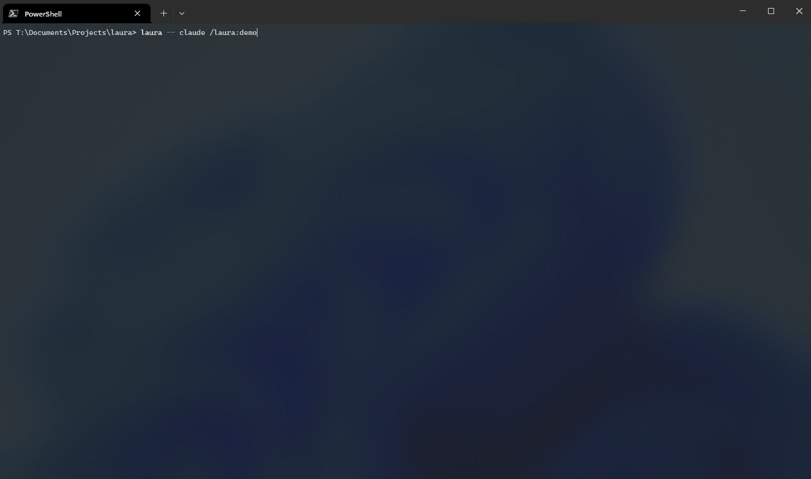

<div align="center">

$\Huge\textsf{Laura}$

</div>

<p align="center"><em>LOW-rah</em> — a tui workspace your agent builds with you while you work.</p>

---

Every coding agent UI in a terminal is a **stream you scroll**, another chat interface. Laura makes it a **surface you and your agent compose** — an **API over the TUI**. Your agent procedurally assembles the workspace — which panels, laid out where, refreshed by what — for the task in front of you, instead of every session getting the same fixed layout.

_Currently_, Laura hosts your agent's shell in a PTY, and you or the agent open files into live panels — splitting the tab into a composable tree of panes (plan here, logs there, a diff below). Mark a file up in place and your review is injected straight back into the agent's chat. The *show → react → revise* loop never leaves the terminal; the protocol is the general form.

<p align="center"></p>

## Quickstart

**1. Install Laura.** Requires Rust (stable); installs a `laura` binary:

```bash
cargo install --git https://github.com/thomaseleff/laura-tui laura --locked
```

Or from a clone: `cargo build --release --locked` → `target/release/laura`.

**2. Install the skill** so your agent knows how to drive `laura`. In Claude Code:

```
/plugin marketplace add thomaseleff/laura-tui
/plugin install laura@laura-tui
```

**3. Start Laura** — it hosts your default shell in a tab:

```bash
laura
```

**4. Chat with your agent** in that shell. With the skill installed, it uses Laura's verbs itself — splitting panes and opening files into them while your shell stays live alongside. You comment on a line in place and submit; your review is injected straight back into the agent's chat and it revises. The *show → react → revise* loop never leaves the terminal.

The panel is **live-watched** — edit the source and it re-renders on changes. `.md`/`.markdown` render with terminal styling (headings, bold, code); every other file shows its raw bytes, with Nord syntax colours for recognized code files. Rendering is display-only — comments and reviews always quote the plain line text. To review by hand: `laura ready` once to enable submission, focus the panel (`Ctrl+P` then its **digit**), press `c` to comment a line and `S` to submit.

See the [tutorial](docs/tutorial.md) for a first session, [how-to](docs/how-to.md) for task recipes, the [CLI reference](docs/cli.md) for the verb set, the [protocol](docs/protocol.md) for the wire format, and the [explanation](docs/explanation.md) / [technical vision](docs/technical-vision.md) for why Laura exists.

## Keys

`Ctrl+P` panes popup (a **digit** focuses that pane) · `Ctrl+T` tab nav (`←/→` browse · `n` new tab · `x` close tab) · `Ctrl+H` help · `Ctrl+Q` quit (then `y`) · `F12` lock all input to the shell. In a focused panel: `↑/↓` move · `c` comment · `S` submit · `Esc` leave. Otherwise every key reaches the shell untouched (Shift/Ctrl/Alt combos included).

## Windows / ConPTY

The PTY reader runs on its own thread for two ConPTY reasons: it answers the DSR handshake (ConPTY withholds all child output until the host replies to `ESC[6n` with `ESC[<row>;<col>R`), and it detects child exit via `child.wait()` (the master reader never returns EOF on exit).

## License

MIT — see [LICENSE](LICENSE).
