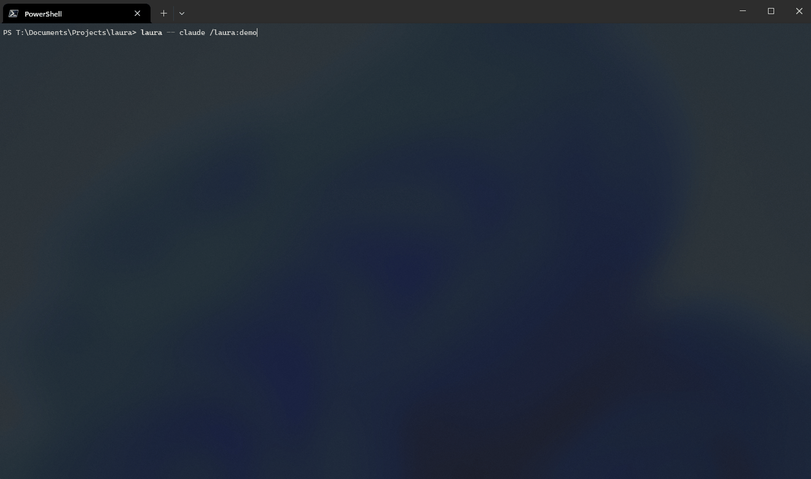

# Laura

Laura is a TUI workspace that gives your agent an **API over the TUI**, so your agent can tile panes while you pair-program.



Your agent can open the file you're discussing, the plan you're following, the diff you just made, or tail the logs of your running service. Laura works with every coding agent CLI, and your agent learns the `laura` CLI from Laura's agent skills.

> [!NOTE]
> Laura makes collaborating with your coding agent more enjoyable: riffing, reviewing live, solving problems and improvising together, without leaving the terminal.

**Laura lets you:**

- **Stay in the flow** - view a file, a plan, a diff, or a log right in the TUI, without switching windows between the terminal, IDE, and browser.
- **Compose the TUI** - your agent tiles the workspace as you chat, using the `laura` CLI and skills.
- **Pick your coding agent CLI** - Laura runs your agent in a plain shell, so Laura works with every agent CLI and model.
- **Interact in every pane** - comment on any file pane and submit the inline review into the chat.
- **Edit alongside your agent** *(experimental)* - edit a file in Neovim in an editor pane next to the chat, then flip to the file view to review your edits with your agent. [Enable editor panes](cli.md#editor-panes).
- **Learn while staying focused** - your agent shows and explains concepts live, step by step.

## How it works

Laura runs your agent CLI in a shell and provides agent skills that you or your agent can invoke. Your agent learns the `laura` CLI from the skills. The `laura` CLI sends messages to the workspace over an NDJSON protocol, with one socket per tab. See the [protocol reference](protocol.md) to learn more.

## Quickstart

**1. Install Laura.**

```bash
uv tool install laura-tui          # prebuilt for Linux, macOS and Windows
cargo install laura-tui --locked   # or build from source, with Rust (stable)
```

**2. Install the skills** so your agent knows how to use the `laura` CLI. In Claude Code:

```
/plugin marketplace add thomaseleff/laura-tui
/plugin install laura@laura-tui
```

**3. Start Laura** and run the interactive demo:

```bash
laura -- claude "/laura:demo"
```

**4. Pair-program.** Chat as you normally would with your coding agent. Ask your agent to show you a file, a plan, or a diff using the `/laura` skill.

Laura reloads a file pane when its file changes. Laura renders markdown with terminal styling, shows other files with syntax colours, and marks the lines changed since git `HEAD` in the gutter.

## Where to go next

**Tutorial**

- **[Tutorial](tutorial.md)** A step-by-step walkthrough.

**Reference**

- **[Navigating the TUI](navigation.md)** The workspace keystrokes.
- **[Agent reference](agent-reference.md)** How your agent uses the `laura` CLI.
- **[CLI reference](cli.md)** Every `laura` command and its flags.
- **[Protocol reference](protocol.md)** The messages the `laura` CLI sends to the workspace.
